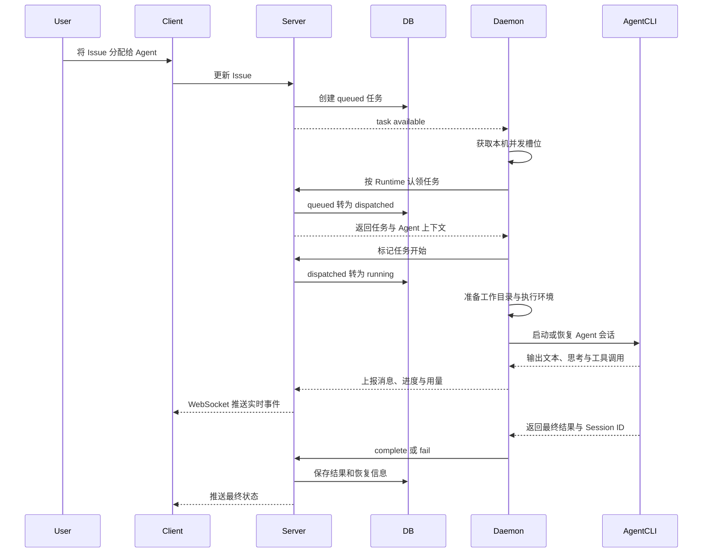

## 前言

随着Claude Code、Codex等Coding Agent的能力越来越强，AI编程正在从“在IDE里辅助一个开发者写代码”，逐渐变成“多个Agent同时承担不同的开发任务”。但是，当Agent的数量增加以后，新的问题也随之出现：任务应该分配给谁？Agent当前正在做什么？执行失败后如何恢复？多个Agent如何共享团队的规范和经验？人又应该如何参与到Agent的工作流中？

[Multica](https://multica.ai/)就是为了解决这些问题而设计的。官方将它定位为一个面向人类与Agent团队的开源项目管理平台。它并不是一个新的大模型，也不直接替代Claude Code、Codex等Coding Agent，而是在这些Agent之上增加了一层任务管理、运行时调度和团队协作能力。

在Multica中，Agent是一种与人类成员对等的“团队成员”：它可以被分配Issue、在评论中被`@`、主动回复消息、更新任务状态，也可以通过Autopilot执行定时或Webhook触发的工作。用户不需要为每一个任务复制提示词并守在终端前等待，而是可以像给同事安排工作一样，将任务分配给Agent，再通过看板和时间线跟踪整个执行过程。

Multica还提供了Workspace、Project、Squad、Skill、Chat等协作能力。其中，Workspace负责隔离团队资源，Project和Issue负责组织工作，Squad用于将多个Agent组成由Leader Agent负责路由的小队，Skill用于沉淀可复用的团队经验。通过这些抽象，Multica试图将一次性的Coding Agent调用，转化为可以持续运行、可以被观察、可以复用经验的工程工作流。

Multica这个名字来自**Multiplexed Information and Computing Agent**，同时也是对Multics操作系统的致敬。Multics通过分时系统让多个用户共享计算资源，而Multica希望在AI时代实现类似的多路复用：让一个小团队能够同时调度多个Agent，在不同任务上下文中并行工作。

Multica支持云服务和自托管两种部署方式，项目源码托管在[GitHub](https://github.com/multica-ai/multica)。本文基于2026年8月8日的官方公开资料和本地源码进行分析，源码版本为`996eb07dc`。下面将从架构、工作原理和运行时调度三个方面，了解Multica是如何将Coding Agent组织成团队成员的。

## 架构和工作原理

Multica采用控制面与执行面分离的分布式架构。Server是控制面，负责保存业务数据、编排任务和同步状态；Daemon与Agent CLI组成执行面，运行在真正具备代码、凭证和开发工具的机器上，负责执行具体任务。

这种设计的关键点是：**Multica Server本身不直接调用大模型，也不直接执行Agent任务**。真正的模型请求、文件修改、命令执行和测试运行，都由Claude Code、Codex等Agent CLI完成。Multica负责把“什么时候执行、由谁执行、在哪里执行、执行到哪一步”管理起来。

### 整体架构


从上图可以看出，Multica的核心链路分为四层：

|层级|主要实现|职责|
|----|----|----|
|交互层|Next.js Web、Electron Desktop、Mobile、`multica` CLI|创建和管理Issue、Agent、Runtime、Skill等资源，展示任务状态和执行消息|
|控制层|Go Server、Chi Router、WebSocket Hub|身份与权限校验、任务入队与状态机、Runtime管理、事件广播、Autopilot调度|
|数据层|PostgreSQL|保存Workspace、Issue、Agent、Runtime、任务队列、消息流水、会话和用量数据|
|执行层|Multica Daemon、Agent CLI|认领任务、准备工作目录和上下文、启动Agent进程、收集输出并上报结果|

Server与Daemon之间不是简单的远程命令调用关系。Server将任务持久化到`agent_task_queue`中，Daemon则以Runtime为单位认领任务。任务即使在Daemon暂时离线时也仍然保存在数据库中；Daemon恢复在线后，可以继续认领尚未执行的任务。任务唤醒事件用于降低等待时间，周期轮询则作为兜底，两者共同构成了执行链路。

### 核心组件

#### 客户端

Multica提供Web、桌面端、移动端和命令行等多种交互入口。Web端基于Next.js，桌面端基于Electron，两者共享`packages/core`、`packages/ui`和`packages/views`中的业务逻辑与界面组件。

客户端主要负责展示和交互，服务端数据由TanStack Query管理，本地界面状态由Zustand管理。客户端通过HTTP API提交操作，通过WebSocket接收Issue、Comment、Agent、Task等资源的实时事件。因此，Agent刚刚认领任务、发出一条消息或完成执行时，用户不需要刷新页面就能看到状态变化。

#### Server

Server是Multica的控制中心，使用Go实现，HTTP路由基于Chi，数据库访问代码由sqlc生成。它主要负责以下工作：

* 管理Workspace、成员、Issue、Project、Agent、Skill和Autopilot等业务数据。
* 根据Issue分配、评论`@Agent`、Chat消息或Autopilot触发创建任务。
* 将任务写入`agent_task_queue`，维护`queued`、`dispatched`、`waiting_local_directory`、`running`、`completed`、`failed`、`cancelled`等状态。
* 管理Runtime注册、心跳、在线状态和任务认领。
* 保存Agent执行过程中产生的消息、结果、Token用量、Session ID和工作目录。
* 通过WebSocket将资源变更和任务进度广播给客户端。

Server只做业务决策和任务编排，不负责运行Agent。这个边界使Multica可以在不关心底层模型实现的情况下，同时管理多种Coding Agent。

#### Runtime与Daemon

Runtime表示一个能够运行特定Agent CLI的执行能力，例如一台开发机上的Codex或Claude Code。Daemon则是运行在这台机器上的后台进程，它会检测本机可用的Agent CLI，并为每个Provider向Server注册对应的Runtime。

一个Daemon可以同时连接多个Workspace，也可以注册多个Runtime。Daemon会为每个Runtime维护独立的任务认领循环和心跳，某一个Runtime的网络请求变慢时，不会阻塞其他Runtime。Daemon内部还有统一的并发槽位，用于限制整台机器上同时执行的任务数量。

Daemon是控制面和本地开发环境之间的边界。仓库代码、Git凭证、模型凭证以及实际的Shell环境可以留在用户自己的机器上，Server只需要下发任务上下文并接收执行结果。对于自托管场景，这也使Server与执行节点可以分别部署。

#### Agent CLI适配层

`server/pkg/agent`定义了统一的Agent执行接口，并分别适配Claude Code、Codex、Copilot、Gemini、OpenCode、OpenClaw、Cursor Agent等Provider。Daemon根据Agent绑定的Runtime选择对应适配器，再将模型、思考等级、自定义参数、MCP配置和恢复会话ID转换成具体CLI能够识别的启动参数。

各家CLI的输出协议并不相同，适配层会将它们统一转换为文本、思考过程、工具调用、错误和Token用量等消息。Daemon只需要消费统一的消息流，就可以将执行过程实时上报给Server。

> Multica统一的是任务生命周期和运行时接口，而不是各家Agent内部的推理方式。模型选择、上下文窗口、工具调用能力和会话机制，最终仍由对应的Agent CLI决定。

#### PostgreSQL与实时事件

PostgreSQL是系统的事实来源。Issue、Agent和Runtime等业务对象，以及任务状态、消息流水和会话恢复信息都会被持久化。WebSocket负责让变化实时可见，但它不是任务状态的唯一载体；即使客户端断开连接，任务仍然可以继续执行，重新连接后再从Server读取最新状态。

这种“数据库保存事实，WebSocket传播变化”的方式，避免了将任务可靠性绑定在某一条长连接上。Server还会定期检查Runtime心跳和异常任务，对离线Runtime、长时间停留在`dispatched`或`running`状态的任务进行清理或恢复。

### 工作流程

下面以“用户将一个Issue分配给Agent”为例，说明一次任务从创建到完成的主要流程：



整个过程可以分为以下几个阶段：

1. **任务入队**：当Issue被分配给Agent、评论中提到Agent、用户发送Chat消息，或Autopilot被触发时，Server创建一条任务记录。任务会绑定Agent和Runtime，但不会在Server进程中直接执行。
2. **唤醒与认领**：Server在任务入队后向对应Runtime发送唤醒信号。Daemon也会按固定周期轮询，因此即使唤醒事件丢失，任务仍然能够被发现。Daemon会先取得本机并发槽位，再请求认领任务，避免任务已经进入`dispatched`状态却长时间等待本机执行资源。
3. **原子调度**：Server按Runtime查找可执行任务，同时检查Agent自身的`max_concurrent_tasks`限制。数据库以原子方式将任务从`queued`更新为`dispatched`，防止多个Daemon重复认领同一个任务。
4. **环境准备**：Daemon收到任务后，将Agent配置、Workspace上下文、Skill、Project资源和Issue信息整理成运行时上下文。对于同一个Agent与Issue的后续任务，它会尽量复用之前保存的工作目录和Session ID；无法恢复时则创建新的执行环境。具体注入内容将在“运行时调度”章节展开介绍。
5. **启动Agent**：Daemon根据Runtime的Provider创建对应Backend，以准备好的工作目录作为当前目录启动Agent CLI。真正的大模型请求、代码修改、命令执行和测试都发生在这个子进程中。
6. **过程同步**：Daemon持续读取Agent输出，将不同Provider的消息转换为统一格式，再把进度、工具调用、文本结果和Token用量上报给Server。Server持久化这些信息，并通过WebSocket推送给正在查看任务的客户端。
7. **完成与恢复**：执行结束后，Daemon上报`completed`或`failed`，并同时保存Session ID和工作目录。后续评论或Chat消息可以基于这些信息恢复原来的Agent会话。如果Daemon异常离线或任务超时，Server的后台检查机制会回收异常状态，并对符合条件的基础设施类失败进行重试。

因此，从工作原理上看，Multica并不是把一段Prompt转发给模型这么简单。它在Coding Agent之外建立了一套持久化任务队列、Runtime注册与健康检查、并发控制、会话恢复和实时事件系统，使Agent执行具备了传统任务调度系统所需要的可靠性和可观察性。

## 运行时调度

<!-- 介绍 MultiCA 如何完成运行时调度，以及调度过程中如何为运行时准备工作目录。 -->

### 调度流程

Multica采用的是一种**由执行节点主动认领任务的拉取式调度**。Server负责决定任务属于哪个Agent和Runtime，并将任务持久化到队列中；[Daemon](https://multica.ai/docs/daemon-runtimes)负责判断本机是否还有执行能力，再主动向Server领取任务。两者之间的WebSocket只承担“有新任务了”的快速唤醒，不承载任务本身，真正的认领仍然通过带鉴权的HTTP请求和数据库状态转换完成。

这种设计将调度事实保存在Server和PostgreSQL中，同时把本机资源判断留给Daemon。即使WebSocket断开或唤醒消息丢失，周期轮询仍然可以发现任务；即使多个Daemon同时发起认领，数据库的原子更新也能保证一条任务只会交给一个执行者。


整个调度过程可以分为以下几个阶段：

1. **任务入队**：Issue分配、评论`@Agent`、Chat消息、Autopilot或Quick Create等触发器会在`agent_task_queue`中创建一条`queued`任务。任务在入队时已经绑定Agent和Runtime，并带有优先级、触发来源和重试次数等信息。
2. **唤醒Runtime**：Server向订阅了相关Runtime ID的Daemon发送任务可用事件。Daemon收到事件后会将唤醒信号广播给内部的Runtime Poller；如果长连接不可用，Poller仍会按`MULTICA_DAEMON_POLL_INTERVAL`配置的周期检查任务。本文分析的源码版本中，兜底轮询默认值为30秒。
3. **先获取本机槽位**：Daemon有一个整机共享的并发槽位池，当前源码默认最多同时运行20个任务。每个Runtime Poller必须先从池中取得槽位，才能调用认领接口；如果槽位已经用尽，它不会提前认领任务，而是继续等待下一次唤醒或轮询。
4. **按Runtime原子认领**：Server先查找该Runtime下的候选任务，再检查Agent的`max_concurrent_tasks`。候选任务按优先级降序、创建时间升序排列；数据库使用`FOR UPDATE SKIP LOCKED`锁定其中一条，并在同一条语句中将状态从`queued`更新为`dispatched`。
5. **准备并启动**：Daemon取得任务后先处理可选的本地目录锁，再调用StartTask将状态切换为`running`，构造任务上下文和工作目录，最后以该目录为`cwd`启动对应的Agent CLI。
6. **执行与回收**：Agent CLI运行期间，Daemon持续收集文本、思考、工具调用和Token用量，并上报给Server。执行成功、失败或取消后，Daemon保存Session ID和工作目录，释放并发槽位，Poller随即可以继续领取下一条任务。

> 官方[执行任务文档](https://multica.ai/docs/tasks)描述了任务状态、超时和重试规则。需要注意的是，调研时公开文档仍将兜底轮询写为3秒，而本文对应的`996eb07dc`源码已将`DefaultPollInterval`设为30秒；该值可以配置，实际任务通常由WebSocket立即唤醒，并不需要等待完整轮询周期。

这里“先取槽位、后领任务”的顺序非常关键。`dispatched`表示任务已经被某个Daemon接管，Server会对长时间没有进入`running`的任务执行派发超时检查。如果先认领再等待本机空位，大量任务会堆积在`dispatched`，并可能在真正开始之前就被判定为超时。Multica让满载时的任务继续停留在没有派发超时的`queued`状态，从状态语义上消除了这个竞争窗口。

调度还同时受到三层约束：

|约束|作用范围|实现方式|
|----|----|----|
|Daemon并发限制|同一台执行机器上的全部Runtime|Daemon共享槽位池，默认20，可通过环境变量调整|
|Agent并发限制|同一个Agent的全部任务|Server统计`dispatched`、`waiting_local_directory`和`running`任务，并与Agent的`max_concurrent_tasks`比较|
|上下文串行限制|同一Agent处理同一Issue或Chat会话|认领SQL排除已经存在活跃任务的相同上下文，避免同一个Agent并发处理同一条工作流|

其中第三层约束只限制“同一个Agent处理同一个上下文”。不同Agent仍然可以同时处理同一条Issue，这正是Squad协作和评论中并行`@Agent`能够成立的基础。对于没有Issue的Chat任务，串行键使用`chat_session_id`；Quick Create任务也会按Agent串行，防止多个创建结果发生关联竞争。

Multica还处理了认领响应丢失的边界情况：如果Server已经把任务改成`dispatched`，但HTTP响应没有到达Daemon，后续认领会优先找出“已经派发但从未开始”的旧任务，刷新派发时间并重新交付，而不是永久丢失这条任务。任务运行后，Daemon每5秒检查一次服务端状态；一旦用户取消任务或任务记录被删除，就会取消Agent进程的执行上下文，并丢弃迟到的结果。

`local_directory`是一条特殊的状态分支。它允许Agent直接操作用户指定的本地目录，因此同一Daemon上指向同一个真实路径的任务必须串行执行。Daemon会在调用StartTask之前取得路径锁；如果锁被其他任务占用，任务状态会从`dispatched`进入`waiting_local_directory`，拿到锁以后再切换到`running`。这样界面能够准确区分“正在启动”和“正在等待本地目录”，也不会出现已经`running`之后再倒退到等待状态的问题。

> 官方文档将Daemon并发限制和Agent并发限制概括为两层限流；从源码实现看，还存在同一Agent与同一Issue/Chat的串行约束，以及`local_directory`的本机路径锁。前两层控制吞吐量，后两层保护任务上下文和文件系统的一致性。

### 运行时工作目录

Daemon不会直接在Multica Server的目录中运行Agent，也不会让所有任务共享一个仓库副本。它在执行机器上维护一个Workspace根目录，并为任务创建独立的执行环境。默认根目录是`~/multica_workspaces`；使用命名Profile时默认为`~/multica_workspaces_<profile>`，也可以通过`MULTICA_WORKSPACES_ROOT`修改。

在代码中需要区分两个概念：

* **EnvRoot**：Daemon管理的任务环境根目录，负责承载工作目录、输出、日志和Provider专用配置。
* **WorkDir**：传给Agent CLI的当前工作目录，也就是Agent执行Shell、查找项目级配置和检出仓库时所处的位置。

普通任务中，WorkDir位于EnvRoot内部，目录结构如下：

```text
~/multica_workspaces/
├── .repos/                              # Workspace仓库的本地缓存
└── <workspace-id>/
    └── <task-id-short>/                 # EnvRoot
        ├── workdir/                     # WorkDir，也是Agent CLI的cwd
        │   ├── CLAUDE.md / AGENTS.md / GEMINI.md
        │   │                              # 按Provider注入运行时说明
        │   ├── .agent_context/          # 任务上下文
        │   ├── .multica/                # Project等结构化上下文
        │   ├── <provider-skill-dir>/    # Workspace分配给Agent的Skill
        │   └── <checked-out-repo>/      # Agent按需检出的Git Worktree
        ├── output/                      # 任务输出预留目录
        ├── logs/                        # 任务日志预留目录
        ├── codex-home/                  # 仅Codex使用
        ├── openclaw-config.json         # 仅OpenClaw使用
        ├── .multica_sidecar_manifest.json
        └── .gc_meta.json                # 任务结束后写入的GC元数据
```

EnvRoot使用完整Workspace ID和Task ID的短前缀分层，既能隔离不同Workspace，也便于在本地定位某次执行。任务刚创建时，`workdir/`并不包含任何仓库。Daemon只把当前任务允许访问的仓库列表写入上下文；Agent确认需要代码后，再执行：

```bash
multica repo checkout <url> [--ref <branch-or-sha>]
```

这个命令不是让Agent自行对任意URL执行`git clone`。本地Daemon会再次检查URL是否在当前Workspace或Project允许的仓库集合中，更新`<root>/.repos/`下的缓存，然后在WorkDir中创建带独立分支的Git Worktree。多个任务可以复用仓库对象缓存，但各自在独立Worktree中修改文件，减少重复下载的同时避免工作区相互覆盖；一个任务也可以按需检出多个仓库。

#### 新建与工作目录复用

对于第一次执行的任务，Daemon会创建新的EnvRoot，并以空的`workdir/`开始准备环境。任务完成或失败时，Server会保存Daemon返回的WorkDir。后续同一个Agent继续处理同一条Issue或Chat会话时，Server会把之前的路径重新下发；只要目录仍然存在，Daemon就复用原来的WorkDir，并重新执行上下文和Provider配置的准备流程。不同注入项能否原地刷新并不完全一致，当前源码中Sidecar文件与非Codex Skill仍存在复用差异，后文会逐项说明。

工作目录复用保留了上一轮已经检出的仓库、未提交修改和构建结果，使“评论补充要求”可以继续使用相同的文件状态。但是，**复用WorkDir不等于恢复模型会话**：前者恢复本地文件，后者恢复Agent CLI内部保存的对话历史、工具状态和上下文，两者分别由WorkDir和Session ID控制。

#### Session ID从哪里来

Session ID不是Multica Server统一创建的业务ID，而是Agent适配层对不同Provider“会话句柄”的统一称呼。Daemon启动Agent CLI以后，Backend从CLI的结构化输出或会话创建响应中取得原生标识，再将它归一化为`agent.Result.SessionID`。少数Provider要求调用方先提供会话句柄，这时由Backend在本地创建，再传给CLI使用。

|Provider|Multica保存为Session ID的内容|恢复方式|
|----|----|----|
|Claude Code|`stream-json`输出中`system`或`result`事件的`session_id`|下次启动追加`--resume <session-id>`|
|Codex|`codex app-server`执行`thread/start`或`thread/resume`返回的Thread ID|通过JSON-RPC调用`thread/resume`|
|Copilot、OpenCode、Cursor等|CLI结构化事件中的`sessionId`、`session_id`或等价会话字段|转换为各CLI的`--resume`或`--session`参数|
|Hermes、Kimi、Kiro|ACP的`session/new`、`session/resume`或`session/load`响应中的`sessionId`|通过ACP恢复或加载原会话|
|OpenClaw|Backend预先生成的`multica-<timestamp>`会话句柄，CLI也可能在结果中返回Session ID|再次把同一个句柄交给OpenClaw|
|Pi|Backend预先创建的Session JSONL日志文件路径|将该路径重新传给`--session`|

因此，数据库中的`session_id`列虽然是字符串，但其语义并不完全相同：对Claude Code是会话UUID，对Codex是Thread ID，对Pi则是执行机器上的文件路径。Multica Server不会解析这些会话的内部内容，只负责保存这个不透明句柄，并在下一次执行时交还给同一个Provider。

Session ID只是索引，真正的会话数据仍由对应CLI保存在执行机器上。例如Codex虽然使用任务独立的`CODEX_HOME`，但其中的`sessions/`会链接到共享的`~/.codex/sessions/`，因此新任务创建的`codex-home/`仍然能够通过Thread ID找到旧会话；Pi的恢复数据就是Session ID所指向的JSONL文件。也正因为会话状态依赖本地文件，Server不能仅凭数据库中的字符串在任意Runtime上重建会话。

#### Session ID如何持久化

Session ID有两次写入机会。第一次发生在任务运行过程中：如果Backend能够在启动早期确定会话句柄，就会发送带`SessionID`的统一`MessageStatus`事件。Daemon首次收到该事件后，立即调用`/api/daemon/tasks/{taskId}/session`，把Session ID和当前WorkDir写入`agent_task_queue`。这样即使Daemon在任务中途崩溃，Server仍然拥有可供自动重试使用的恢复指针。

当前源码中，Claude Code会在收到包含`session_id`的`system`事件后发送这条状态消息；Codex会在`thread/start`或`thread/resume`取得Thread ID后发送。其他Backend如果只能在进程退出时拿到会话标识，则不会获得同等的中途崩溃保护。

第二次发生在任务结束时。Backend把最终Session ID放入`Result`，Daemon在上报`completed`或`failed`时再次携带Session ID和WorkDir。Server最终将两者写回任务记录；对于Chat任务，还会在同一个数据库事务中更新`chat_session`的Session ID、WorkDir和Runtime ID，避免下一条Chat消息在任务完成与恢复指针更新之间读到旧值。

整个保存链路如下：

```text
Agent CLI创建或恢复会话
        ↓ 原生sessionId / threadId / session文件路径
Provider Backend归一化为SessionID
        ↓ MessageStatus（运行早期，可选）
Daemon中途Pin SessionID + WorkDir
        ↓ Result（任务结束）
Server再次保存到agent_task_queue
        ↓ Chat任务同步更新chat_session
下一次认领返回PriorSessionID + PriorWorkDir
```

#### 下一次任务如何恢复会话

对于Issue任务，Server按`agent_id + issue_id`查找最近一次包含Session ID的已完成任务或可安全恢复的失败任务；对于Chat任务，优先读取`chat_session`上的恢复指针，并以最近的任务记录作为兜底。已知会导致上下文再次失败的“污染会话”会被排除，不会继续下发。

Server只在新任务仍由**同一个Runtime**执行时返回`PriorSessionID`。这是因为会话数据通常保存在执行机器和对应CLI自己的本地目录中，换一台机器即使拿到同样的字符串也未必能够找到会话。Daemon将这个值写入统一的`ExecOptions.ResumeSessionID`，再由Provider Backend翻译成`--resume`、`thread/resume`、`session/resume`等原生命令。

如果目录和会话都存在，Agent就同时继承上一次的文件状态与对话上下文。如果恢复请求失败，并且Backend没有建立有效的新会话，Daemon会清除`ResumeSessionID`再尝试启动一次全新会话。手动Rerun则会设置`force_fresh_session`，Server从一开始就不下发`PriorSessionID`和`PriorWorkDir`，确保在全新的目录和会话中执行；基础设施错误触发的自动重试则会保留恢复指针，尽可能接着中断位置继续。

#### 工作目录清理

工作目录不会在任务一结束就立即删除，因为后续任务可能需要复用它。Daemon会把正在执行或准备复用的EnvRoot标记为活跃，防止GC与任务并发删除目录；任务结束后写入`.gc_meta.json`，记录它关联的是Issue、Chat、Autopilot还是Quick Create。当前源码默认每小时执行一次GC：对于仍然活跃的Issue会保留工作目录，并可先清理`node_modules`、`.next`、`.turbo`等可再生构建产物；对于已经结束且超过保留期的任务，再删除整个EnvRoot。中途崩溃、没有GC元数据的环境则按孤儿目录策略延迟回收。

#### `local_directory`模式

如果Project绑定的是当前Daemon拥有的`local_directory`资源，工作目录模型会发生变化：Daemon仍然创建EnvRoot来保存`output/`、`logs/`和GC记录，但不会创建`EnvRoot/workdir/`，而是直接把用户配置的绝对路径作为WorkDir。这个过程没有复制、挂载或Git Worktree，Agent会原地读写用户目录。

```text
~/multica_workspaces/<workspace-id>/<task-id-short>/   # EnvRoot
├── output/
├── logs/
├── .multica_sidecar_manifest.json
└── .gc_meta.json

/Users/kael/workspace/example-project/                 # WorkDir / Agent cwd
└── 用户原有文件 + 执行期间的Multica上下文
```

直接操作用户目录的风险明显高于隔离Worktree，因此源码增加了几项保护：路径必须是绝对路径，并且要通过存在性、目录类型、读写权限和系统路径黑名单检查；软链接解析后的真实路径会作为锁键，避免两个不同路径实际指向同一个目录；同一路径上的任务只能串行执行。

此外，Multica注入上下文时不会无条件覆盖用户已有的`CLAUDE.md`、`AGENTS.md`或`GEMINI.md`，而是在标记区间内追加或刷新托管内容。其他新建文件会记录在EnvRoot中的Sidecar Manifest里；任务退出时，Daemon只删除自己创建的文件和空目录，并移除运行时说明的托管区块，尽量把用户目录恢复到执行前的状态。`local_directory`不会参与普通WorkDir复用，GC也不会删除用户目录或该任务留下的EnvRoot日志簿。

因此，Multica的工作目录并不只是一个临时`cwd`。它同时承担了文件隔离、仓库缓存复用、会话延续、Provider配置发现和执行审计等职责。下一节将继续拆解其中每一类注入内容，说明Agent究竟从这些文件和环境变量中获得了哪些能力。

### 工作目录注入内容概览

从Agent的视角看，“注入工作目录”并不只是向`workdir/`复制几个文件。Multica实际使用了三类载体：第一类是Agent能够在WorkDir中直接发现的说明文件和Skill；第二类是EnvRoot中的Provider专用配置；第三类是在启动Agent CLI时通过环境变量、命令行参数、ACP请求或Prompt传入的瞬时上下文。

因此，MCP虽然通常也被称为“工作目录注入内容”，但它并不一定在WorkDir中生成文件。例如Claude Code读取系统临时文件，OpenCode读取环境变量，Kimi、Kiro和Hermes通过ACP请求接收配置。为了完整描述Agent实际得到的上下文，下面将这三类载体放在一起分析。

|注入项|载体|首次注入|复用时的更新方式|任务结束后的处理|
|----|----|----|----|----|
|Runtime说明|`CLAUDE.md`、`AGENTS.md`或`GEMINI.md`|WorkDir准备完成后|每轮替换Multica托管区块|普通目录保留；`local_directory`移除托管区块|
|任务上下文|`.agent_context/issue_context.md`|`Prepare()`阶段|当前版本已有文件不会被覆盖，最新事实以Runtime说明和Prompt为准|普通目录保留到GC；`local_directory`按Manifest删除|
|Agent Skill|Provider原生Skill目录；Codex位于`codex-home/skills/`|`Prepare()`阶段|Codex清空后重建；其他Provider当前会避让旧目录并新建副本|普通目录保留到GC；`local_directory`删除本轮创建项|
|Project资源|`.multica/project/resources.json`|`Prepare()`阶段|当前版本已有文件不会被覆盖，Runtime说明中的摘要会更新|普通目录保留到GC；`local_directory`按Manifest删除|
|MCP|临时文件、`config.toml`、环境变量、ACP请求或OpenClaw配置|Agent启动前|每次启动、恢复会话或复用环境时重新生成|瞬时载体立即消失，配置文件随EnvRoot回收|
|Codex执行环境|`EnvRoot/codex-home/`|`Prepare()`阶段|`Reuse()`重新同步共享Codex配置并重建Skill|随EnvRoot回收；共享Session目录保留|
|OpenClaw执行环境|`EnvRoot/openclaw-config.json`等|`Prepare()`阶段|`Reuse()`重新解析用户配置并生成Wrapper|随EnvRoot回收|
|运行时环境变量|Agent子进程环境|每次启动Agent CLI前|每轮从最新任务和Agent配置重新构造|进程退出即消失|
|本轮Prompt|CLI参数、stdin或ACP `session/prompt`|每次调用Agent时|每轮重新构造；不会因为Session恢复而沿用旧Prompt|不作为WorkDir文件保留|
|Daemon管理元数据|EnvRoot中的Manifest和GC Meta|环境准备时、任务结束时|按当前环境状态重写|供清理和GC使用，不属于Agent业务上下文|

这里没有将Repository列为注入项。Daemon首次准备的是空WorkDir，Repository只会先以“允许检出的仓库列表”出现在Runtime说明中；Agent执行`multica repo checkout`以后，Daemon才会在WorkDir创建Git Worktree。

#### Runtime说明文件：`CLAUDE.md`、`AGENTS.md`和`GEMINI.md`

Runtime说明文件是Agent理解Multica运行环境的主入口，也可以理解为Multica为任务动态生成的“元Skill”。文件名由Provider的原生规则决定：Claude Code使用`CLAUDE.md`，Gemini使用`GEMINI.md`，Codex、Copilot、OpenCode、OpenClaw、Hermes、Pi、Cursor、Kimi、Kiro和Antigravity使用`AGENTS.md`。未知Provider没有对应文件，只返回同样的Runtime Brief供Prompt模式使用。

这份说明并不是只写一个Issue ID，而是包含了Agent完成Multica任务所需要的长期协议和当前上下文：

* Agent身份、名称和自定义Instructions。
* 发起任务的用户信息，以及Workspace级共享Context。
* 当前Issue、触发评论、Chat、Autopilot或Quick Create的任务类型。
* `multica issue`、`multica repo`、`multica attachment`等CLI命令的使用方式。
* 当前允许访问的Repository和Project资源摘要。
* Agent绑定的Skill列表及其发现路径。
* 不同任务类型的执行流程，例如读取Issue、更新状态、回复评论和结束任务。
* 评论父子关系、Mention防循环、附件下载、输出格式等安全规则。

它的写入发生在`Prepare()`或`Reuse()`完成之后、构造本轮Prompt之前。因此即使复用了旧WorkDir，Daemon仍会根据这次任务重新生成完整Runtime Brief。Multica使用下面的Marker管理自己负责的区块：

```markdown
<!-- BEGIN MULTICA-RUNTIME (auto-managed; do not edit) -->
...本轮生成的Runtime Brief...
<!-- END MULTICA-RUNTIME -->
```

文件不存在时，Daemon创建只包含该区块的新文件；文件已经存在但没有Marker时，说明它属于用户或Repository，Daemon保留原文并在末尾追加托管区块；再次执行时只替换两个Marker之间的内容，不会反复追加，也不会覆盖用户写在区块外的规则。

普通隔离WorkDir会被保留下来供后续任务复用，所以更新后的文件也会一直存在，最终随EnvRoot被GC删除。`local_directory`操作的是用户真实目录，任务退出时Daemon会精确移除Marker区块：如果文件原本不存在就删除整个文件，如果原本已有内容则逐字节恢复到注入前的状态，避免用户之后手动运行Agent时误读上一轮Multica任务。

#### 任务上下文：`.agent_context/issue_context.md`

Runtime说明文件保存的是完整工作协议，`.agent_context/issue_context.md`则是一个更短、更适合程序或Agent快速读取的任务摘要。它在`Prepare()`调用`writeContextFiles()`时写入，内容随任务类型变化：

* Issue任务写入Issue ID、Assignment或Comment Reply触发类型、触发评论ID和Quick Start命令。
* Quick Create写入用户在快速创建窗口中的原始输入。
* Autopilot写入Autopilot ID、Run ID、标题、触发来源、Payload和运行说明。
* 任务绑定Skill时，还会附上本轮可用的Skill名称列表。

在`local_directory`模式下，Daemon不会覆盖用户已经存在的同名文件。如果`.agent_context/issue_context.md`已经存在，写入会被拒绝，但任务不会失败，因为相同的关键事实还会出现在Runtime说明和本轮Prompt中。任务结束时，Sidecar Manifest只删除Daemon本轮实际创建的文件和空目录，用户原有文件保持不变。

需要特别注意当前源码的复用行为。`Reuse()`确实会再次调用`writeContextFiles()`，注释也将其称为“refresh context files”；但本文对应的`996eb07dc`版本仍然传入了Sidecar Manifest，而`recordWriteFile()`在目标已存在时会拒绝覆盖。因此，复用普通WorkDir时，这个文件实际上可能仍然保存上一轮摘要。当前轮次的权威信息应以已更新的Runtime说明和每轮重新构造的Prompt为准，不能把`issue_context.md`单独当成强一致的数据源。

#### Agent Skill

Multica的Skill采用[Agent Skills开放规范](https://agentskills.io)，一个Skill由`SKILL.md`和可选的脚本、配置、参考资料等Supporting Files组成。Workspace中的Skill绑定到Agent以后，Server在派发任务时将内容下发给Daemon，Daemon再按照Provider的原生发现路径写入执行环境。

|Provider|Skill注入路径|
|----|----|
|Claude Code|`WorkDir/.claude/skills/<slug>/`|
|Codex|`EnvRoot/codex-home/skills/<slug>/`|
|Copilot|`WorkDir/.github/skills/<slug>/`|
|OpenCode|`WorkDir/.opencode/skills/<slug>/`|
|OpenClaw|`WorkDir/skills/<slug>/`|
|Pi|`WorkDir/.pi/skills/<slug>/`|
|Cursor|`WorkDir/.cursor/skills/<slug>/`|
|Kimi|`WorkDir/.kimi/skills/<slug>/`|
|Kiro|`WorkDir/.kiro/skills/<slug>/`|
|Antigravity|`WorkDir/.agents/skills/<slug>/`|
|Gemini、Hermes及未知Provider|`WorkDir/.agent_context/skills/<slug>/`，属于通用回退路径|

每个Skill目录至少包含`SKILL.md`。如果正文缺少YAML Frontmatter，Daemon会自动补充`name`和可选的`description`；如果已有Frontmatter但没有有效的`name`，则只补`name`，其余字段保持不变。Supporting Files保留相对目录结构写入，重复出现的`SKILL.md`会被跳过。

首次任务在`Prepare()`阶段写入这些文件。为了保护`local_directory`里的用户Skill，如果自然生成的`<slug>`已经存在，Multica不会覆盖，而是依次尝试`<slug>-multica`、`<slug>-multica-2`等名称。任务结束后，Manifest只删除本轮创建的Skill，不会碰用户原有目录或任务执行期间新放进去的文件。

Codex的更新策略最完整。因为`CODEX_HOME`被切换到了任务独立目录，Daemon在每次`Prepare()`和`Reuse()`时都会清空`codex-home/skills/`，先同步用户共享`~/.codex/skills/`，再写入Workspace分配的Skill；同名时Workspace版本优先。这样修改或取消绑定的Skill、用户删除的本地Skill以及Supporting Files的变化都能在下一轮准确生效。

其他Provider在当前源码中仍有一个复用差异：`Reuse()`写Skill时沿用了“已有目录不覆盖”的碰撞保护，因此旧Skill目录不会原地更新，而可能新增`-multica`后缀副本；已经取消绑定的旧Skill也会继续留到整个EnvRoot被GC。Runtime说明中的Skill清单每轮都会更新，但Provider的目录扫描仍可能发现这些旧副本。这是本文所调研版本的实际行为，不能把Codex的“清空后重建”语义直接推广到所有Provider。

#### Project资源：`.multica/project/resources.json`

任务属于Project或携带Project Resources时，Daemon会创建：

```text
WorkDir/.multica/project/resources.json
```

文件使用结构化JSON保存`project_id`、`project_title`和完整的`resources`数组。每个Resource包含ID、类型、类型相关的`resource_ref`和可选Label。例如`github_repo`的`resource_ref`中可以保存URL和默认分支提示。即使Project暂时没有Resource，Daemon也会写入空数组，用文件的存在表示“当前任务属于一个Project”。Skill、脚本或Agent本身可以读取它获得完整的Resource Ref；Runtime说明中则同时保留一份适合人阅读的摘要。

该文件在`Prepare()`阶段首次生成。如果用户目录已经有同名文件，Daemon拒绝覆盖并降级为只使用Runtime说明中的摘要；`local_directory`任务结束后，仅当文件确实由Daemon创建时才会通过Manifest删除。

与`issue_context.md`相同，当前版本的`Reuse()`虽然再次执行写入流程，但已有`resources.json`会触发“拒绝覆盖”保护，因此文件本身不一定随Project Resource变化而刷新。Runtime说明会使用本轮最新资源重新生成，Repository允许列表也由本轮任务重新计算；需要机器读取强一致资源信息时，应意识到这一版本差异。

#### MCP配置

Skill解决“Agent应该知道什么、按什么方法做”，MCP解决“Agent能够连接并调用哪些外部工具”。Agent的MCP设置保存在`agent.mcp_config`中，任务执行时再由Provider Backend转换成各自支持的格式。根据当前源码和官方[AI Coding Tools Matrix](https://multica.ai/docs/providers)，12个Provider中有7个会消费该配置：Claude Code、Codex、Hermes、Kimi、Kiro、OpenCode和OpenClaw；Antigravity、Copilot、Cursor、Gemini和Pi当前没有显式的Managed MCP注入实现。

|Provider|注入方式|首次注入与更新|清理方式|
|----|----|----|----|
|Claude Code|写入系统临时目录中的`multica-mcp-*.json`，通过`--mcp-config <path>`传入，并启用`--strict-mcp-config`|每次启动CLI时根据最新`mcp_config`创建|进程结束后删除临时文件，不写WorkDir|
|Codex|转换为`EnvRoot/codex-home/config.toml`中的`[mcp_servers.<name>]`托管区块|每次Backend执行前更新；Managed配置是权威来源，空集合也表示明确禁用继承MCP|旧托管区块在重写时先移除，文件随EnvRoot回收|
|OpenCode|转换为`OPENCODE_CONFIG_CONTENT={"mcp":{...}}`|每次启动子进程时重新生成，`agent.mcp_config`优先于用户同名环境变量|进程退出即消失，不修改`WorkDir/opencode.json`|
|Hermes、Kimi|转换成ACP `mcpServers`数组|每次`session/new`或`session/resume`都重新传入|不落盘，由ACP Session和进程管理|
|Kiro|转换成ACP `mcpServers`数组|每次`session/new`或`session/load`都重新传入|不落盘，由ACP Session和进程管理|
|OpenClaw|写入`EnvRoot/openclaw-config.json`中的`mcp.servers`；必要时生成去掉用户MCP的`openclaw-user-snapshot.json`|`Prepare()`和`Reuse()`都会重新生成Wrapper，Managed空集合也具有“禁用继承”的含义|配置位于EnvRoot，最终随环境回收|

Codex和OpenClaw对Managed MCP采用严格替换语义：一旦Agent保存了Managed配置，包括显式空集合，就不再把用户全局MCP服务器悄悄合并进来。Codex会清除任务副本中继承的`mcp_servers`表，并把`config.toml`权限收紧为`0600`；OpenClaw则在需要时生成一份去除用户`mcp.servers`的配置快照，再由Wrapper提供唯一的Managed集合。这样既避免同名冲突，也避免管理员以为Agent只连接指定服务，实际却额外继承本机工具。

MCP的更新时间与工作目录是否复用无关。它要么在`Reuse()`阶段重建Provider配置，要么在Backend每次执行、创建或恢复Session时重新传入。因此修改Agent的MCP配置后，下一次任务启动就会使用新配置；已经运行中的Agent进程不会热更新。

#### Codex专用执行环境：`codex-home`

Codex除了Skill和MCP，还需要一套任务独立的`CODEX_HOME`。Daemon在`EnvRoot/codex-home/`创建执行环境，并通过`CODEX_HOME`环境变量让Codex使用它，而不是直接修改用户的`~/.codex/`：

```text
EnvRoot/codex-home/
├── sessions -> ~/.codex/sessions/
├── auth.json -> ~/.codex/auth.json
├── config.json
├── config.toml
├── instructions.md
├── skills/
└── plugins/cache -> ~/.codex/plugins/cache/
```

`sessions/`和`auth.json`采用链接，使会话日志和认证状态可以跨任务共享；`config.json`、`config.toml`和`instructions.md`采用副本，避免任务修改污染用户全局配置。Daemon还会在`config.toml`中写入Sandbox与网络策略、禁用Codex原生Multi-Agent和自动Memory的托管区块，并在Backend启动前更新前面介绍的MCP区块。

第一次执行时由`Prepare()`创建并同步。复用WorkDir时，`Reuse()`会重新同步共享配置：源文件发生修改就重新复制，源文件被删除则移除任务中的旧副本；认证链接、Plugin Cache、Sandbox策略和Skill也会重新校正。因此`codex-home`不是第一次创建后就冻结的快照。

任务结束后它不会立即删除，因为同一个环境可能继续复用。整个EnvRoot被GC时，任务独立的配置和Skill一起删除；`sessions/`指向的是共享目录，真正的Codex Session日志仍然保留，这也是后续任务能够根据Thread ID恢复会话的基础之一。

#### OpenClaw专用执行环境：Config Wrapper

OpenClaw的原生Skill扫描依赖Workspace路径。为了让它发现`WorkDir/skills/`，Daemon会在EnvRoot生成`openclaw-config.json`，把`agents.defaults.workspace`以及每个`agents.list[].workspace`都重写为当前WorkDir，再通过`OPENCLAW_CONFIG_PATH`交给子进程。

如果用户已经有OpenClaw配置，Wrapper会通过`$include`继承原配置，并使用`OPENCLAW_INCLUDE_ROOTS`授权跨目录读取；如果Agent配置了Managed MCP，还可能创建权限为`0600`的`openclaw-user-snapshot.json`，其中保留用户其他设置但移除全局`mcp.servers`，再由Wrapper注入本轮唯一的MCP集合。用户原配置文件不会被修改。

这两个文件在`Prepare()`阶段生成。复用环境时，`Reuse()`会重新调用OpenClaw CLI解析当前用户配置，刷新Agent列表、Workspace指向和MCP内容；解析或写入失败时选择阻止复用，而不是静默退化成缺少用户认证和Provider设置的最小配置。它们位于EnvRoot而非WorkDir，最终随环境一起回收。

#### 运行时环境变量

Daemon在每次启动Agent CLI之前构造一组只对该子进程生效的环境变量。固定上下文包括：

```text
MULTICA_TOKEN
MULTICA_SERVER_URL
MULTICA_DAEMON_PORT
MULTICA_WORKSPACE_ID
MULTICA_AGENT_NAME
MULTICA_AGENT_ID
MULTICA_TASK_ID
MULTICA_TASK_SLOT
PATH
```

`MULTICA_TOKEN`优先使用Server在认领任务时签发、绑定Agent与Task的Task-scoped Token，旧Server没有返回时才回退到Daemon凭证。`multica` CLI依靠这些变量访问Server和本地Daemon，例如读取Issue、发表评论或请求`repo checkout`。`MULTICA_TASK_SLOT`表示当前任务占用的Daemon全局并发槽位，并不是Agent内部的线程编号。

Autopilot和Quick Create还会条件注入`MULTICA_AUTOPILOT_RUN_ID`、`MULTICA_AUTOPILOT_ID`和`MULTICA_QUICK_CREATE_TASK_ID`。Codex与OpenClaw分别增加`CODEX_HOME`、`OPENCLAW_CONFIG_PATH`和可选的`OPENCLAW_INCLUDE_ROOTS`。Daemon还会把自身可执行文件所在目录放到`PATH`前面，确保Agent在隔离环境中仍能找到`multica`命令。

Agent设置中的`custom_env`也会合并进子进程，例如`ANTHROPIC_API_KEY`、自定义Base URL或Bedrock开关。但用户不能覆盖所有`MULTICA_*`变量，也不能覆盖`HOME`、`PATH`、`USER`、`SHELL`、`TERM`、`CODEX_HOME`和OpenClaw内部配置变量，避免破坏任务身份、路由或执行环境。

这些变量不写入WorkDir，每个任务都会根据最新的任务、Agent和Daemon配置重新构造。进程启动后不会热更新，Agent进程退出后随进程环境一起消失。

#### 本轮Prompt与内联System Prompt

Runtime说明文件负责相对稳定的工作协议，本轮Prompt负责变化最快、必须在这一轮被Agent直接关注的信息。`BuildPrompt()`根据任务类型分别构造Assignment、Comment、Chat、Autopilot和Quick Create Prompt。例如Comment任务会直接嵌入最新评论内容、作者类型和当前Trigger Comment ID；Chat任务会嵌入用户消息和附件ID；Quick Create则明确当前没有Issue，并给出创建Issue的字段和输出规则。

Prompt在每次Agent执行前重新生成，即使恢复了同一个Session也不会复用上一轮Prompt。这对评论任务尤其重要：恢复的模型会话可能记得旧评论，但新Prompt会再次强调“本轮新评论”和新的Parent Comment ID，降低Agent把回复发到旧Thread的风险。

大多数Provider通过WorkDir中的Runtime说明文件加载完整协议。OpenClaw、Kimi和Kiro的工作目录发现链路不够稳定，Daemon还会把同一份Runtime Brief放入`ExecOptions.SystemPrompt`，由Backend以内联方式追加到本轮请求；Hermes明确不走这条路径，避免已经从WorkDir读取说明后再次重复上下文。

Prompt和内联System Prompt都不是WorkDir文件，而是通过CLI参数、stdin或ACP请求交给Provider。它们每轮更新，进程结束后不会作为Sidecar遗留；恢复Session以后Provider是否在自身会话历史中保留上一轮Prompt，则由对应CLI的会话机制决定。

#### Daemon管理元数据：Sidecar Manifest与GC Meta

EnvRoot中还有两个JSON文件，它们不是给Agent阅读的任务上下文，而是Daemon为清理工作目录维护的内部账簿。

`.multica_sidecar_manifest.json`在`Prepare()`时创建，记录Daemon在WorkDir中新建的文件和目录绝对路径。`Reuse()`也会根据本轮写入结果重写Manifest。它主要服务于`local_directory`：任务退出时先删除记录中的文件，再从最深层开始删除空目录；已经被用户放入新内容的非空目录会保留。Runtime说明文件没有登记在这里，因为它使用独立的Marker机制恢复。

`.gc_meta.json`在任务完成回调之后最后写入，记录Workspace ID、完成时间，以及环境属于Issue、Chat Session、Autopilot Run还是Quick Create Task。GC据此向Server判断父对象是否仍然活跃、环境是否已经达到回收条件。如果Daemon在任务中途崩溃，这个文件还来不及写，目录会被当作Orphan并按孤儿TTL处理。

普通隔离任务的两个文件最终都随EnvRoot删除。`local_directory`退出时Sidecar Manifest在完成精确清理后被删除，`.gc_meta.json`仍留在EnvRoot中；GC看到`local_directory`标志后不会删除用户目录，也会保留这个EnvRoot中的输出和日志供排查。

## 总结

从定位上看，Multica不是Claude Code、Codex等Coding Agent的替代品，而是运行在这些Agent之上的任务管理与调度平台。它将Issue、评论、Chat和Autopilot产生的工作统一转换成持久化任务，再通过Runtime和Daemon交给用户自己的执行机器处理。模型能力仍然来自各个Agent CLI，Multica解决的是多个Agent如何被组织、调度、观察和恢复的问题。

这套架构最重要的特点是控制面与执行面分离。Server和PostgreSQL保存任务、状态和会话等事实，WebSocket负责快速通知，Daemon通过周期轮询兜底并主动认领任务。原子认领、Daemon并发槽位、Agent并发限制、同一上下文串行约束以及本地目录锁，共同保证任务不会被重复执行，也不会因为多个Agent同时操作同一份上下文而破坏文件和会话状态。即使客户端断开或Daemon短暂离线，任务仍然可以继续排队和恢复。

运行时工作目录则是Multica连接“平台任务”与“本地Coding Agent”的关键边界。Daemon为普通任务维护可复用的EnvRoot和WorkDir，并通过Runtime说明文件、任务上下文、Skill、Project资源、MCP、Provider专用配置、环境变量和本轮Prompt，将平台中的身份、规则、工具和任务事实转换成Agent能够理解的原生载体。任务完成后保存的Session ID和工作目录，使后续评论或Chat消息可以同时恢复模型会话与文件现场，而不是每次从一段全新的Prompt重新开始。

从源码实现看，Multica已经具备一个Agent调度平台的主要能力，但不同Provider之间的成熟度仍然存在差异。例如Codex的Skill和配置更新语义相对完整，部分Provider复用WorkDir时可能保留旧Skill副本；`issue_context.md`和Project资源文件在当前版本中也不一定原地刷新；公开文档中的轮询间隔与源码默认值还存在差异。因此，Multica提供的是统一的任务生命周期和运行时协议，并不意味着所有Agent CLI在会话、MCP、Skill和Sandbox方面已经拥有完全一致的行为。

如果团队只是偶尔在IDE中调用一次AI补全，引入Server、PostgreSQL和Daemon的收益可能有限；但当任务已经可以被拆成Issue，需要多个Agent异步并行工作，并且希望集中管理团队规范、执行权限、进度和结果时，Multica的价值就会比较明显。它把原本散落在多个终端中的一次性Agent调用，转化成了可排队、可观察、可恢复、可复用上下文的工程工作流。

总体来说，Multica真正调度的并不只是大模型请求，而是包含任务状态、本地代码、Agent会话、团队知识和外部工具在内的完整执行上下文。这也是它与简单的多Agent聊天界面或CLI启动器最本质的区别。本文结论基于`996eb07dc`版本源码，Multica仍在快速迭代，具体Provider能力和注入行为应以实际部署版本的源码和运行结果为准。
